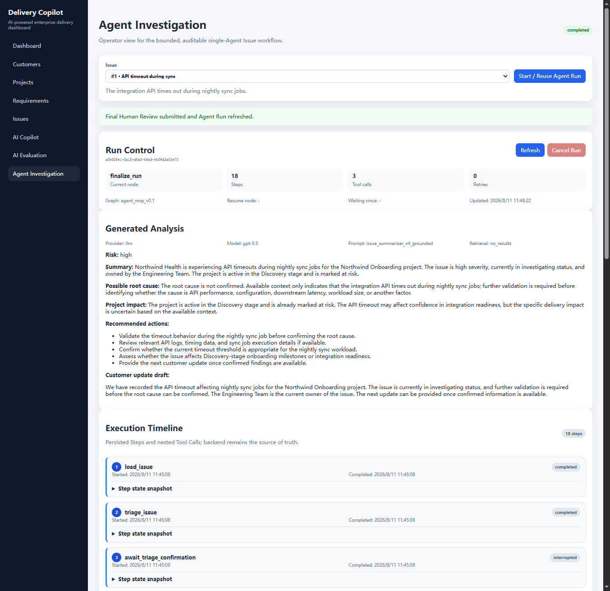
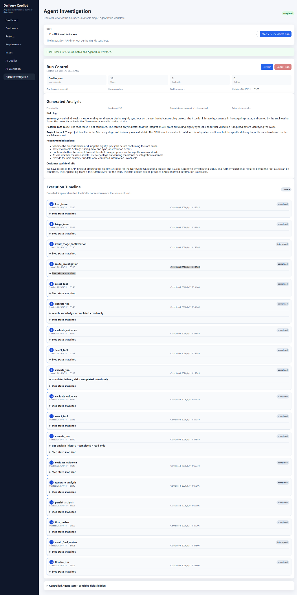
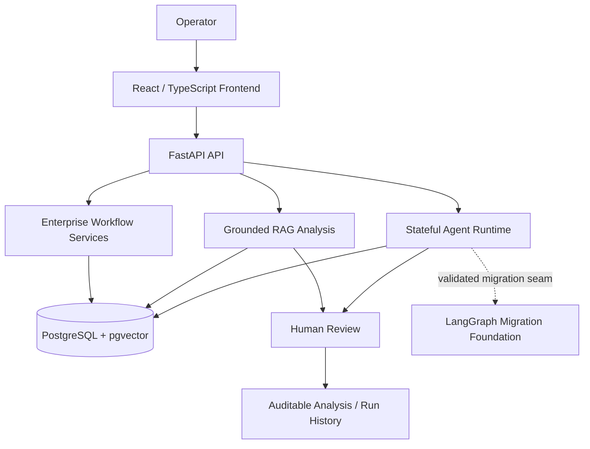
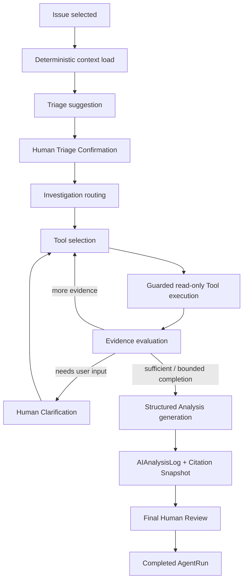
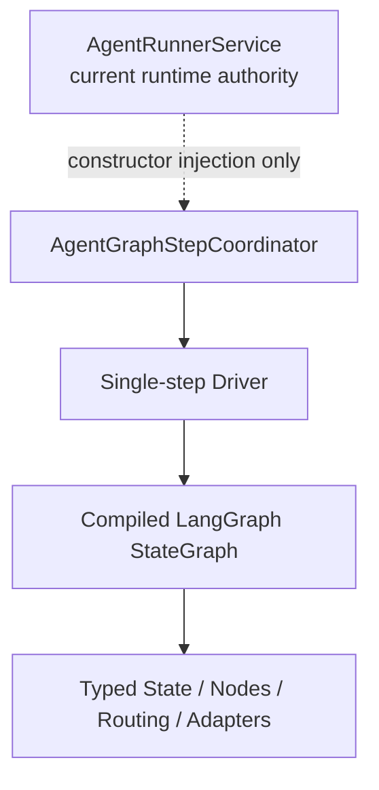
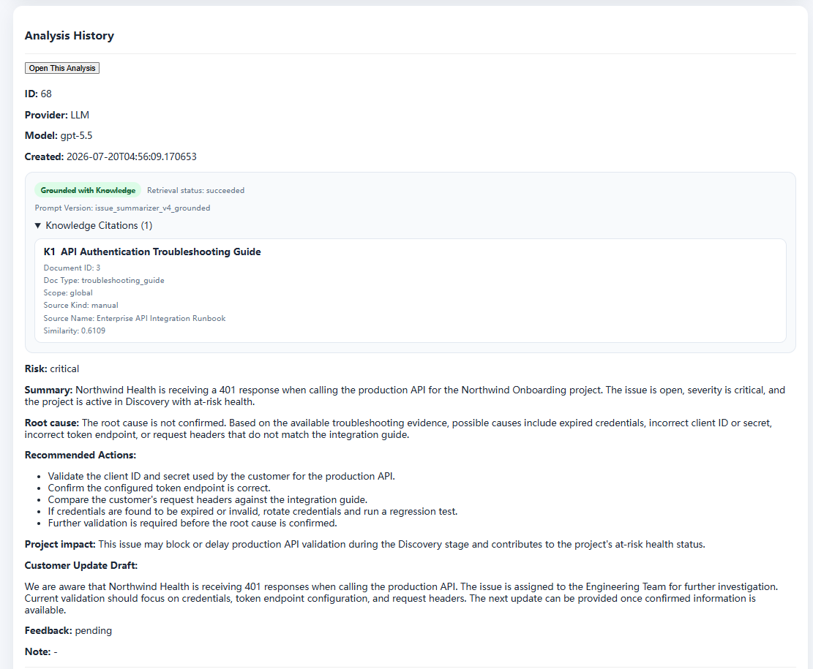
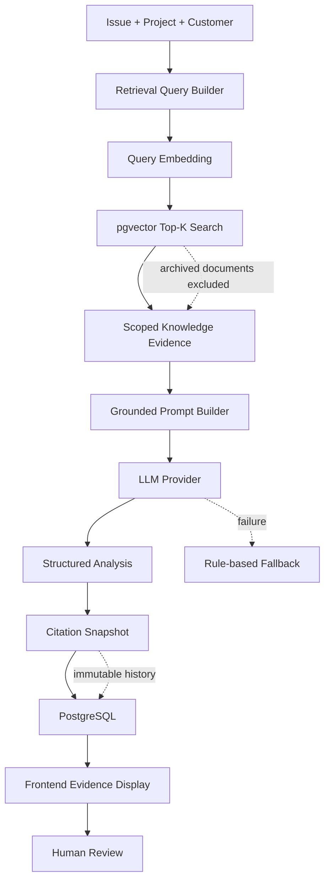

# Delivery Copilot

AI-powered enterprise delivery and issue management platform with persisted Grounded RAG, a bounded stateful Agent workflow, Human-in-the-loop review, auditable evidence, and a validated LangGraph migration foundation.

Delivery Copilot is a portfolio implementation for AI Product Manager, Technical Product Manager, Forward Deployed Engineer, Solutions Engineer, and Implementation Engineer roles. It is not a generic chatbot and not a simple CRUD demo.



The screenshot shows a completed bounded Agent Run with 18 persisted Steps, 3 approved read-only Tool calls, structured Analysis generation, final Human Review, and an auditable execution timeline. It is a separate operator demonstration from the 21-step Human Clarification acceptance scenario documented below.

<details>
<summary>View the complete Agent execution timeline</summary>



</details>

`gpt-5.5` is the accepted E2E evidence model recorded in the portfolio acceptance evidence. The example configuration in `.env.example` and `compose.yaml` defaults to the configurable `gpt-4.1-mini`; operators can select another compatible model through environment configuration.

## Business Problem

Enterprise delivery teams often work with customer, project, requirement, issue, and troubleshooting knowledge that is fragmented across systems and people. That fragmentation makes investigation, blocker escalation, customer updates, and knowledge reuse slower and less auditable than they should be.

Delivery Copilot addresses that workflow with two complementary AI paths:

1. a persisted Grounded RAG issue-analysis path for evidence-backed structured analysis; and
2. a bounded stateful Agent path for multi-step investigation, tool use, Human Clarification, resume, and final review.

The product treats evidence, state, failure handling, and human control as first-class parts of the workflow rather than assuming that one successful LLM call is enough.

## Current As-built System Architecture

The system has three distinct layers: the enterprise workflow and data layer, two implemented AI execution paths, and a LangGraph migration foundation that is **not** the current Agent runtime authority.



### Stateful Agent execution path



### LangGraph migration seam



### Architecture truth boundary

The current runtime Agent is **not** driven by LangGraph. `AgentRunnerService`, together with orchestration and persistence services, remains the production business execution authority for the local portfolio runtime.

The repository also contains a validated LangGraph foundation: typed state, graph topology, nodes, routing, read-only and `execute_tool` adapters, a single-step Driver, checkpoint identity classification, and `AgentGraphStepCoordinator`. The Coordinator is constructor-injected into `AgentRunnerService`, but the production Runner does not yet call the Coordinator.

Persistent production Checkpointer deployment, DB/Checkpoint reconciliation, and full orchestration takeover remain outside the implemented portfolio scope.

## What Is Implemented

### Enterprise workflow

- Customer management
- Project delivery tracking
- Requirement management
- Issue lifecycle tracking
- Dynamic dashboard metrics
- AI Issue Summarizer
- Analysis History
- AI evaluation metrics based on Human Review outcomes
- Human-in-the-loop feedback: `accepted` / `rejected` / `edited_and_accepted`
- Operator-facing Agent Investigation UI with triage, clarification, final review, cancellation, and persisted execution timeline

### Grounded RAG

- Manual knowledge ingestion
- Knowledge document and chunk persistence
- Real `text-embedding-v4` integration
- 1536-dimensional pgvector embeddings
- Batch embedding and safe retry
- Top-K cosine retrieval
- global / customer / project scope resolution
- retrieval status persistence
- Citation Snapshot persistence
- archived documents excluded from new retrieval while historical snapshots remain immutable
- prompt injection boundary for untrusted evidence
- grounded prompt version `issue_summarizer_v4_grounded`
- frontend citation display

#### Grounded RAG evidence example



Analysis #68 records `gpt-5.5`, `Grounded with Knowledge`, one business-facing citation, Document #3, and the API Authentication Troubleshooting Guide / Enterprise API Integration Runbook evidence trail.

### Stateful Agent runtime

The implemented Agent runtime persists execution instead of treating the Agent as one opaque request.

```text
Issue
→ deterministic context load
→ triage suggestion
→ Human Triage Confirmation
→ bounded investigation
→ approved Tool selection / execution
→ evidence evaluation
→ optional Human Clarification
→ structured Analysis generation
→ AIAnalysisLog persistence
→ Final Human Review
→ completed auditable Run
```

Implemented runtime capabilities include:

- persisted `AgentRun`, `AgentStep`, and `AgentToolCall` audit records;
- active-run reuse for the same Issue under a database lock;
- bounded execution with finite step and Tool-call limits;
- loop-stall detection and state/node consistency checks;
- same-Run resume from persisted Human Gates;
- cancellation and recovery cancellation;
- replay-aware Tool-call result reuse;
- row-lock-based state protection for critical persistence transitions;
- controlled error outcomes rather than silently restarting a Run;
- browser redaction of retrieval query, chunk text, source URI, credentials, and secret-like state.

### Approved investigation tools

The current dynamic Agent Tool Registry contains exactly three approved read-only tools:

- `search_knowledge`
- `get_analysis_history`
- `calculate_delivery_risk`

Issue context loading is a deterministic Runner/service step before dynamic investigation. It is not a fourth dynamically selected Tool in the current registry.

### Agent evidence guardrail

The accepted Agent demo uses a conservative `0.65` similarity boundary. Below-threshold chunks remain in the immutable Tool audit trail but are excluded from generation prompts and Citation Snapshots. This is an accepted demo baseline, not a universal production threshold.

## Grounded RAG Architecture



## Runtime Failure and Consistency Behavior

This repository intentionally includes failure-path behavior that a visual prototype would not exercise.

### LLM/provider failure

The OpenAI-compatible LLM provider degrades to a rule-based fallback for controlled failure categories including:

- missing API key;
- timeout;
- HTTP error;
- request / connection error;
- invalid JSON;
- schema validation error;
- unexpected response structure;
- unexpected provider exception.

Provider and model metadata remain observable so fallback output is not silently presented as a successful LLM result.

### API and Agent state behavior

The API distinguishes missing resources, invalid state transitions, and persistence failures rather than flattening them into one generic error. Agent creation locks the Issue row before checking for an active Run so concurrent requests can reuse the current active Run instead of intentionally creating duplicate workflows.

The implementation includes controlled 404, 409, and 500 paths, transaction rollback, Tool timeout/failure states, cancellation, `limit_exceeded`, and explicit waiting states for human input.

### Docker runtime

`compose.yaml` runs PostgreSQL with pgvector and a healthcheck. The backend waits for a healthy database, applies Alembic migrations, and then starts FastAPI. LLM and embedding providers are independently configurable through environment variables.

## Verified End-to-End Evidence

### Grounded RAG acceptance

| Evidence | Verified result |
| --- | --- |
| Final demo Analysis | #68 |
| Provider | llm |
| Model | gpt-5.5 |
| Prompt version | issue_summarizer_v4_grounded |
| Retrieval status | succeeded |
| Knowledge grounded | true |
| Citation count | 1 |
| Citation document | Document #3 |
| Similarity | approximately 0.6109 |
| Human review status | pending |
| Vector dimensions | 1536 |

Analysis #67 is the pre-archive acceptance record, while Analysis #68 is the cleaned-up portfolio record. Smoke Test Document #4 was archived after acceptance. Historical Citation Snapshots were not rewritten.

This Grounded RAG acceptance is separate from the Agent Demo acceptance. The historical #68 record is not rewritten by the Agent `0.65` evidence guardrail.

- [Grounded RAG acceptance report](docs/grounded-rag-acceptance.md)
- [Analysis #67 evidence snapshot](docs/evidence/grounded-rag-analysis-67.json)

### Agent Demo runtime acceptance

The operator-facing Agent workflow was exercised locally against the real Docker Compose backend on 2026-08-10.

| Scenario | Verified result |
| --- | --- |
| Triage Human Gate | persisted interrupt and resume |
| Approved Tools | 3 read-only Tool calls, auditable in the timeline |
| Weak RAG evidence | `0.6089` rejected by the `0.65` Agent guardrail |
| Human Clarification | focused API-timeout question and persisted response |
| Post-clarification generation | 20 Steps to Final Review; `Retrieval: no_results` |
| Final completion | 21 Steps, 3 Tool calls, 0 retries |
| Cancellation | normal waiting cancellation and failed-Step recovery cancellation |
| UI security boundary | retrieval query, chunk text, source URI, and secret-like values redacted |

The accepted runtime path is documented in the [Agent Demo acceptance report](docs/agent/agent-demo-acceptance.md).

## Structured AI Output

The AI issue summarizer returns a strict six-field JSON contract:

- `issue_summary`
- `possible_root_cause`
- `recommended_actions`
- `customer_update_draft`
- `risk_level`
- `project_impact`

The structured output is validated with Pydantic / JSON contract checks and then routed into Human Review.

## Technology Stack

### Frontend

- React
- TypeScript
- Vite
- CSS

### Backend

- Python
- FastAPI
- SQLAlchemy
- Pydantic

### AI and retrieval

- OpenAI-compatible LLM provider
- accepted E2E evidence model: `gpt-5.5`
- configurable example default model: `gpt-4.1-mini`
- example default in `.env.example` and `compose.yaml`: `gpt-4.1-mini`
- Alibaba Cloud Model Studio `text-embedding-v4`
- pgvector cosine similarity
- structured prompt and rule-based fallback provider architecture
- LangGraph orchestration foundation with a single-step Driver and checkpoint identity boundary

### Data and runtime

- PostgreSQL
- pgvector
- Alembic
- Docker Compose
- SQLite legacy compatibility where actually retained

## Key Engineering Decisions

1. Grounded evidence is persisted separately from generated text.
2. Historical Citation Snapshots are immutable.
3. Archived knowledge is excluded from new retrieval without deleting vectors.
4. Provider failure degrades to rule-based fallback instead of masquerading as LLM success.
5. Human feedback cannot finalize an analysis twice.
6. `edited_and_accepted` requires nonblank `edited_output`.
7. Current Analysis and History use the same frontend evidence renderer.
8. Retrieval query, chunk text, source URI, and credentials are not exposed in the UI.
9. Agent persistence and business transactions remain owned by orchestration/persistence services rather than Graph nodes.
10. The production Agent runtime is bounded and persisted before LangGraph takeover is attempted.
11. LangGraph is introduced through a Driver and Coordinator seam instead of replacing the existing Runner in one migration.
12. Portfolio claims distinguish a validated orchestration foundation from full production takeover.
13. Below-threshold Agent evidence remains auditable but is excluded from generation and Citation Snapshots.
14. Human-review form state resets between Analysis records so a prior decision cannot be carried into a new Run silently.
15. Dynamic Tool choice is limited to an allowlisted read-only registry; deterministic context loading is not delegated to the model.

## API Highlights

- `GET /health`
- `GET /api/dashboard/metrics`
- `POST /api/knowledge/documents`
- `POST /api/knowledge/chunks/{chunk_id}/embedding`
- `POST /api/knowledge/documents/{document_id}/embeddings`
- `POST /api/knowledge/search`
- `POST /api/ai/issues/{issue_id}/summarize`
- `GET /api/ai/issues/{issue_id}/analyses`
- `PATCH /api/ai/analyses/{analysis_id}/feedback`
- `GET /api/ai/evaluation/metrics`
- `POST /api/agent/runs`
- `GET /api/agent/runs/{run_id}`
- `POST /api/agent/runs/{run_id}/resume`
- `POST /api/agent/runs/{run_id}/cancel`

## Local Development

For complete Windows PowerShell startup and shutdown instructions, see [STARTUP_GUIDE.md](STARTUP_GUIDE.md).

1. Copy `.env.example` to `.env`.
2. Configure required environment variables without exposing real keys.
   - Real-time LLM generation defaults to `AI_LLM_TIMEOUT_SECONDS=120.0`.
   - Keep the environment override available when a compatible provider needs a different timeout.
3. Run `docker compose up --build`.
4. Backend: `http://localhost:8000`
5. Docs: `http://localhost:8000/docs`
6. Frontend:

```bash
cd frontend
npm install
npm run dev
```

7. Frontend URL: `http://localhost:5173`
8. Agent Investigation UI: `http://localhost:5173/agent-runs`

If `npm.ps1` is blocked by PowerShell execution policy, use `npm.cmd`.

## Publicly Verifiable Repository Evidence

- [As-built PRD](PRD.md)
- [As-built architecture](docs/architecture.md)
- [Grounded RAG acceptance report](docs/grounded-rag-acceptance.md)
- [Analysis #67 evidence snapshot](docs/evidence/grounded-rag-analysis-67.json)
- [Agent MVP scope and as-built overlay](docs/agent/agent-mvp-scope.md)
- [Agent state and graph design with as-built overlay](docs/agent/agent-state-and-graph.md)
- [Agent Demo UI frozen scope](docs/agent/agent-demo-ui-scope.md)
- [Agent Demo runtime acceptance](docs/agent/agent-demo-acceptance.md)
- `backend/scripts/validate_portfolio_readme.py`
- `backend/scripts/validate_as_built_prd.py`
- `backend/scripts/validate_architecture_doc.py`
- `backend/scripts/validate_agent_runner_graph_step_coordinator_injection_foundation.py`

The fresh public repository uses file-based evidence and checked-in validators rather than references to private development tags or commits.

## Known Limitations

- Authentication and RBAC are not implemented.
- No public cloud deployment is included.
- No CI/CD pipeline is included.
- Grounded RAG has been accepted on one primary real business scenario.
- The frontend focuses on evidence visibility rather than full design-system polish.
- A dedicated Grounded RAG evaluation dashboard is not yet implemented.
- Runtime demo records are local database state and require seeded or recreated data.
- The Agent similarity guardrail is a conservative demo baseline and requires a representative evaluation set before production calibration.
- The Agent Investigation UI is an operator-facing local demo, not a production operations console.
- The architecture has not been load-tested for production-scale concurrency.
- The validated LangGraph foundation has not taken over the production Runner execution path.
- A persistent production Checkpointer and automated DB/Checkpoint reconciliation are not included in this portfolio scope.

## Portfolio Relevance

This project demonstrates enterprise workflow design, AI product scoping, Grounded RAG, structured output, evidence persistence, Human-in-the-loop review, bounded stateful Agent orchestration, failure handling, concurrency-safe state transitions, replay-aware tool execution, incremental framework migration, and evidence-led validation.

The strongest portfolio claim is not “a LangGraph Agent.” It is that a fixed evidence-backed AI workflow was extended into a persisted, auditable, bounded Agent runtime while keeping human control and introducing LangGraph only as a validated migration seam rather than replacing a stable execution path for technology-showcase reasons.
