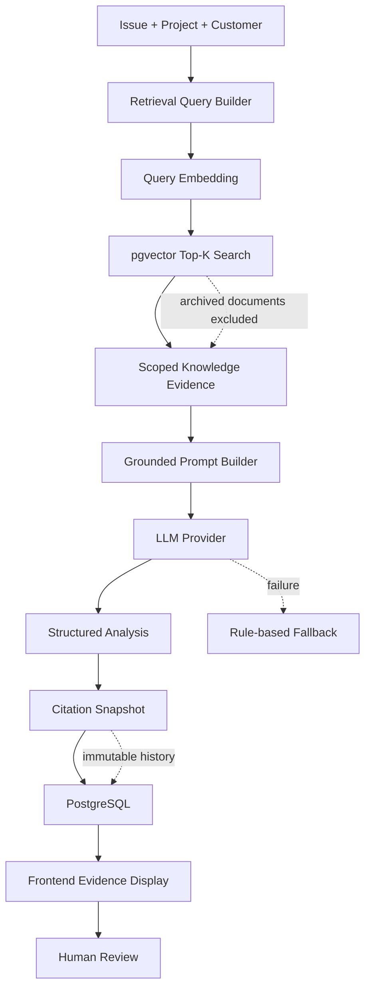

# Delivery Copilot

AI-powered enterprise delivery and issue management platform with grounded RAG, a stateful Agent MVP, a validated LangGraph orchestration foundation, human review, and auditable evidence.

Delivery Copilot is a portfolio project for Forward Deployed Engineers, Solutions Engineers, Implementation Engineers, Technical Product Managers, and enterprise delivery teams.
It is not a generic chatbot and not a simple CRUD demo.


The screenshot shows Analysis #68 using `gpt-5.5` with `Grounded with Knowledge`, one business-facing citation, Document #3, and the API Authentication Troubleshooting Guide / Enterprise API Integration Runbook evidence trail.

`gpt-5.5` is the model recorded in the accepted E2E evidence. The example configuration in `.env.example` and `compose.yaml` defaults to the configurable `gpt-4.1-mini`; operators can select another compatible model through environment configuration.

## Business Problem
Enterprise delivery teams often work with customer, project, requirement, and issue information that is spread across multiple systems.
That fragmentation makes blockers and risk escalation slower than they should be.
Issue analysis and customer updates still depend on manual synthesis.
AI outputs are only useful when they include sources, auditability, and a human review step.

## What Is Implemented

### Product workflow
- Customer management
- Project delivery tracking
- Requirement management
- Issue lifecycle tracking
- Dynamic dashboard metrics
- AI Issue Summarizer
- Analysis History
- Human-in-the-loop feedback: `accepted` / `rejected` / `edited_and_accepted`

### Grounded RAG
- Manual knowledge ingestion
- Knowledge document and chunk persistence
- Real `text-embedding-v4` integration
- 1536-dimensional pgvector embeddings
- Batch embedding and safe retry
- Top-K cosine retrieval
- global / customer / project scope resolution
- retrieval status persistence
- citation snapshot persistence
- prompt injection boundary for untrusted evidence
- grounded prompt version `issue_summarizer_v4_grounded`
- frontend citation display

### Agent MVP and LangGraph orchestration foundation
- Persisted `AgentRun`, `AgentStep`, and `AgentToolCall` audit records
- Controlled single-agent workflow for triage, human confirmation, tool selection, evidence evaluation, clarification, analysis persistence, and final review
- Three approved read-only investigation tools with guarded execution and replay-aware result reuse
- Bounded execution with finite step/tool-call limits, timeout, cancellation, safe failure, and resume behavior
- Validated LangGraph typed state, compiled topology, nodes, routing, adapters, single-step Driver, checkpoint identity classification, and the `AgentGraphStepCoordinator` foundation
- Constructor injection of the Coordinator into `AgentRunnerService` without changing existing production Runner behavior
- Explicit boundary: the production Runner does not yet call the Coordinator; persistent production Checkpointer, DB/Checkpoint reconciliation, and full orchestration takeover remain roadmap items

### AI provider behavior
- real LLM provider
- OpenAI-compatible provider abstraction
- accepted E2E evidence model: `gpt-5.5`
- configurable example default model: `gpt-4.1-mini`
- rule-based fallback
- provider and model observability
- structured six-field JSON output

### Persistence and runtime
- PostgreSQL
- pgvector
- SQLAlchemy
- Alembic
- Docker Compose
- legacy SQLite compatibility where actually retained

## Grounded RAG Architecture



## Verified End-to-End Evidence

| Evidence | Verified result |
| --- | --- |
| Final demo Analysis | #68 |
| Provider | llm |
| Model | gpt-5.5 |
| Prompt version | issue_summarizer_v4_grounded |
| Retrieval status | succeeded |
| Knowledge grounded | true |
| Citation count | 1 |
| Citation document | Document #3 |
| Similarity | approximately 0.6109 |
| Human review status | pending |
| Vector dimensions | 1536 |

Analysis #67 is the pre-archive acceptance record, while Analysis #68 is the cleaned-up portfolio record.
Smoke Test Document #4 was archived after acceptance.
Historical Citation Snapshots were not rewritten.

- [Grounded RAG acceptance report](docs/grounded-rag-acceptance.md)
- [Analysis #67 evidence snapshot](docs/evidence/grounded-rag-analysis-67.json)

## Structured AI Output
The AI issue summarizer returns a strict six-field JSON contract:

- issue_summary
- possible_root_cause
- recommended_actions
- customer_update_draft
- risk_level
- project_impact

The structured output is validated with Pydantic / JSON contract checks and then routed into human review.

## Technology Stack

### Frontend
- React
- TypeScript
- Vite
- CSS

### Backend
- Python
- FastAPI
- SQLAlchemy
- Pydantic

### AI and retrieval
- OpenAI-compatible LLM provider
- accepted E2E evidence model: `gpt-5.5`
- example default in `.env.example` and `compose.yaml`: `gpt-4.1-mini`
- Alibaba Cloud Model Studio `text-embedding-v4`
- pgvector cosine similarity
- structured prompt and fallback provider architecture
- LangGraph orchestration foundation with a single-step Driver and checkpoint identity boundary

### Data and runtime
- PostgreSQL
- pgvector
- Alembic
- Docker Compose
- SQLite legacy compatibility

## Key Engineering Decisions
1. Grounded evidence is persisted separately from generated text.
2. Historical Citation Snapshots are immutable.
3. Archived knowledge is excluded from new retrieval without deleting vectors.
4. Provider failure degrades to rule-based fallback.
5. Human feedback cannot finalize an analysis twice.
6. `edited_and_accepted` requires nonblank `edited_output`.
7. Current Analysis and History use the same frontend evidence renderer.
8. Retrieval query, chunk text, source URI, and credentials are not exposed in the UI.
9. Agent persistence and business transactions remain owned by existing services rather than Graph nodes.
10. LangGraph is introduced through a Driver and Coordinator seam instead of replacing the production Runner in one migration.
11. Portfolio claims distinguish a validated orchestration foundation from full production takeover.

## API Highlights
- `GET /health`
- `GET /api/dashboard/metrics`
- `POST /api/knowledge/documents`
- `POST /api/knowledge/chunks/{chunk_id}/embedding`
- `POST /api/knowledge/documents/{document_id}/embeddings`
- `POST /api/knowledge/search`
- `POST /api/ai/issues/{issue_id}/summarize`
- `GET /api/ai/issues/{issue_id}/analyses`
- `PATCH /api/ai/analyses/{analysis_id}/feedback`
- `GET /api/ai/evaluation/metrics`

## Local Development
1. Copy `.env.example` to `.env`.
2. Configure required environment variables without exposing real keys.
   - Real-time LLM generation defaults to `AI_LLM_TIMEOUT_SECONDS=120.0`.
   - Keep the environment override available when a compatible provider needs a different timeout.
3. Run `docker compose up --build`.
4. Backend: `http://localhost:8000`
5. Docs: `http://localhost:8000/docs`
6. Frontend:

```bash
cd frontend
npm install
npm run dev
```

7. Frontend URL: `http://localhost:5173`

If `npm.ps1` is blocked by PowerShell execution policy, use `npm.cmd`.

## Publicly Verifiable Repository Evidence
- [As-built PRD](PRD.md)
- [As-built architecture](docs/architecture.md)
- [Grounded RAG acceptance report](docs/grounded-rag-acceptance.md)
- [Analysis #67 evidence snapshot](docs/evidence/grounded-rag-analysis-67.json)
- [Agent MVP scope and as-built overlay](docs/agent/agent-mvp-scope.md)
- [Agent state and graph design with as-built overlay](docs/agent/agent-state-and-graph.md)
- `backend/scripts/validate_portfolio_readme.py`
- `backend/scripts/validate_as_built_prd.py`
- `backend/scripts/validate_architecture_doc.py`
- `backend/scripts/validate_agent_runner_graph_step_coordinator_injection_foundation.py`

The fresh public repository uses file-based evidence and checked-in validators rather than references to private development tags or commits.

## Known Limitations
- Authentication and RBAC are not implemented.
- No public cloud deployment is included.
- Grounded RAG has been accepted on one primary real business scenario.
- The frontend focuses on evidence visibility rather than full design-system polish.
- A dedicated Grounded RAG evaluation dashboard is not yet implemented.
- Runtime demo records are local database state and require seeded or recreated data.
- The validated LangGraph foundation has not taken over the production Runner execution path.
- A persistent production Checkpointer and automated DB/Checkpoint reconciliation are not included in this portfolio scope.

## Portfolio Relevance
This project demonstrates product thinking, enterprise workflow design, API and data modeling, AI provider abstraction, retrieval architecture, stateful Agent orchestration, incremental LangGraph migration boundaries, failure handling, human review, evidence-led validation, and cross-functional communication.

It is well suited for AI Product Manager, Technical Product Manager, Forward Deployed Engineer, AI Solutions Engineer, and Implementation Engineer roles.
