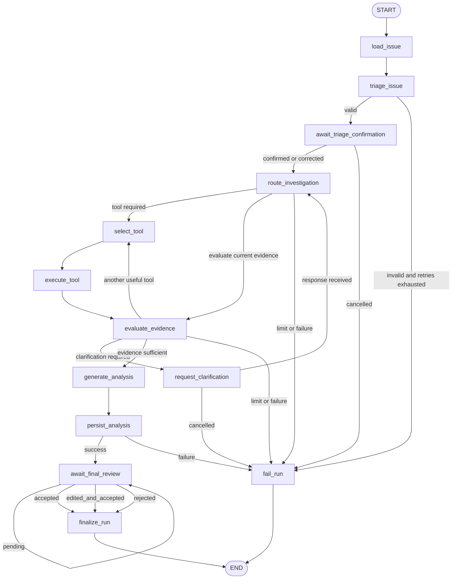

# Delivery Copilot - Agent State and Graph Design

## 1. Document Status

- Status: Historical State/Graph Design with Current As-built Overlay
- Related scope document: `docs/agent/agent-mvp-scope.md`
- Public source of truth: checked-out source, database schema, and validators
- Runtime LangGraph dependency: `langgraph==1.2.10`

This document preserves the original Agent State and Graph design as a historical contract. References to the “frozen design” describe the target that guided implementation; the as-built statements in this section describe the accepted repository state.

The current repository implements the Agent persistence model, lifecycle API, bounded Runner, tool selection and guarded execution, Human Clarification, analysis persistence, final review, and resume behavior. The LangGraph foundation implements typed state, compiled topology, nodes and routing, read-only and `execute_tool` adapters, a single-step Driver, checkpoint identity classification, a Coordinator foundation, and constructor injection into `AgentRunnerService`.

The implemented `agent_runs`, `agent_steps`, and `agent_tool_calls` tables are separate from `AIAnalysisLog` and are documented in `DATABASE_SCHEMA.md`.

LangGraph has not taken over the production Runner execution path. Persistent production checkpoint storage, bootstrap/reconciliation behavior, and automated DB/Checkpoint recovery remain outside the portfolio closure scope.

## 2. Design Objective

The graph upgrades the existing fixed Grounded RAG issue analysis pipeline into a controlled, stateful, auditable, interruptible, and resumable single-agent workflow.

The design must preserve the accepted Grounded RAG capabilities:

- Issue, Project, and Customer context;
- knowledge retrieval;
- grounded evidence;
- the existing six-field structured output;
- Citation Snapshot;
- provider fallback;
- `AIAnalysisLog`;
- final Human Review.

The frozen design assigns LangGraph only to the orchestration layer. The current foundation follows that boundary.

It must not replace the existing FastAPI application, SQLAlchemy models, retrieval service, provider abstraction, structured analysis contract, or Human Review workflow.

## 3. Primary Scenario

The first required scenario is:

**Issue #17 - API Authentication Investigation Agent**

The graph must support this scenario end to end:

```text
User selects Issue #17
-> load Issue context
-> generate AI triage suggestion
-> interrupt for triage confirmation
-> route investigation
-> select approved read-only tools
-> execute tools
-> evaluate evidence
-> request clarification when required
-> generate six-field grounded analysis
-> persist AIAnalysisLog
-> wait for existing Human Review
-> finalize Agent Run
```

The Agent MVP is not a general-purpose autonomous platform.

## 4. Agent Run Status

The frozen design defined the Agent Run status enum below; these statuses are implemented in the current persistence model:

- `created`
- `running`
- `waiting_for_triage_confirmation`
- `waiting_for_clarification`
- `generating_analysis`
- `waiting_for_final_review`
- `completed`
- `failed`
- `cancelled`
- `limit_exceeded`

### 4.1 Status Semantics

`created`
: The Agent Run record exists, but graph execution has not started.

`running`
: The graph is actively executing a node or selecting the next route.

`waiting_for_triage_confirmation`
: AI triage produced a valid suggestion and execution is interrupted until a user accepts, corrects, or cancels it.

`waiting_for_clarification`
: Available tools cannot provide enough information and execution is interrupted until a user supplies clarification or cancels the Run.

`generating_analysis`
: Evidence has been judged sufficient and the graph is producing the existing six-field analysis.

`waiting_for_final_review`
: An `AIAnalysisLog` has been created and the Run is waiting for the existing Human Review workflow.

`completed`
: Final Human Review has closed the workflow, whether the analysis was accepted, edited and accepted, or rejected.

`failed`
: An unrecoverable technical or validation error ended execution.

`cancelled`
: A user intentionally stopped the Run.

`limit_exceeded`
: A finite step, tool-call, retry, or timeout boundary was reached.

Human rejection of AI content is not a technical Agent failure.

## 5. Agent State Contract

The frozen design state contract contains:

```text
run_id
issue_id
current_node
run_status

triage_result
triage_confirmed

selected_tool
tool_results
tool_call_count

retrieved_evidence
evidence_sufficient
evidence_reason

clarification_question
clarification_response

draft_analysis
analysis_log_id

step_count
retry_count
errors

pending_approval
final_status

max_steps
max_tool_calls
max_retries
```

### 5.1 State Field Groups

#### Identity and execution position

- `run_id`
- `issue_id`
- `current_node`
- `run_status`

#### Triage

- `triage_result`
- `triage_confirmed`

#### Tool execution

- `selected_tool`
- `tool_results`
- `tool_call_count`

#### Evidence evaluation

- `retrieved_evidence`
- `evidence_sufficient`
- `evidence_reason`

#### Human clarification

- `clarification_question`
- `clarification_response`

#### Final analysis

- `draft_analysis`
- `analysis_log_id`

#### Safety and failure

- `step_count`
- `retry_count`
- `errors`
- `pending_approval`
- `final_status`
- `max_steps`
- `max_tool_calls`
- `max_retries`

### 5.2 State Serialization Boundary

Agent State may contain only controlled, serializable data.

Agent State must not contain:

- SQLAlchemy `Session` objects;
- ORM model instances;
- provider clients;
- HTTP response objects;
- exception objects;
- API keys;
- credentials;
- provider endpoints;
- uncontrolled raw logs.

Database access and provider execution must occur through controlled application-service or tool execution contexts.

## 6. Triage Result Contract

The frozen design Pydantic triage result contains:

```text
issue_type
subtype
severity
confidence
reason
```

Constraints:

- `issue_type` must use an existing Delivery Copilot Issue Type value;
- `severity` must use an existing Delivery Copilot Severity value;
- `confidence` must be between `0.0` and `1.0`;
- `subtype` may be a controlled nonblank string in the first MVP;
- `reason` must be nonblank;
- invalid output must not enter routing;
- retry is allowed only within the configured retry boundary;
- exhausted validation retries must end safely.

The triage result is a suggestion.

It must not silently overwrite user-entered or user-confirmed Issue fields.

## 7. Graph Nodes

The frozen design graph contains these nodes:

```text
START
load_issue
triage_issue
await_triage_confirmation
route_investigation
select_tool
execute_tool
evaluate_evidence
request_clarification
generate_analysis
persist_analysis
await_final_review
finalize_run
fail_run
END
```

### 7.1 `load_issue`

Responsibilities:

- validate `issue_id`;
- load Issue;
- load linked Project when available;
- load linked Customer when available;
- call the deterministic `load_issue_context` tool;
- store a serializable context snapshot;
- fail safely when the Issue does not exist.

This node is mandatory and deterministic.

### 7.2 `triage_issue`

Responsibilities:

- generate the triage suggestion;
- validate it with the triage Pydantic contract;
- store confidence and reason;
- retry only within `max_retries`;
- route valid output to triage confirmation;
- route exhausted failures to `fail_run`.

### 7.3 `await_triage_confirmation`

Responsibilities:

- persist the triage suggestion;
- set status to `waiting_for_triage_confirmation`;
- interrupt graph execution;
- accept a later user decision;
- continue with accepted or corrected triage data;
- cancel safely when requested.

### 7.4 `route_investigation`

Responsibilities:

- inspect confirmed triage data;
- inspect existing tool results;
- inspect clarification response when present;
- determine whether to select a tool, evaluate current evidence, or fail safely;
- avoid a fixed tool sequence.

### 7.5 `select_tool`

Responsibilities:

- select one approved tool from the Tool Registry;
- consider prior Tool Results;
- avoid unjustified duplicate calls with identical arguments;
- respect `max_tool_calls`;
- store the selected tool and validated arguments.

Dynamic selection is limited to:

- `search_knowledge`
- `get_analysis_history`
- `calculate_delivery_risk`

### 7.6 `execute_tool`

Responsibilities:

- retrieve the Tool definition from the Tool Registry;
- validate input with the Tool input schema;
- enforce timeout and retry policy;
- execute the read-only Tool;
- validate output with the Tool output schema;
- persist a Tool Call audit record;
- append the controlled result to Agent State;
- return failures as structured error data.

Tools must not call `commit()`.

### 7.7 `evaluate_evidence`

Responsibilities:

- inspect all relevant Tool Results;
- decide whether evidence is sufficient;
- provide a nonblank evidence reason;
- route to another useful tool when available;
- route to clarification when human information is required;
- route to analysis when evidence is sufficient;
- route to `limit_exceeded` or `failed` when required.

Evidence sufficiency is a routing decision, not a formal model-accuracy score.

Retrieval similarity remains:

```text
similarity_score = 1 - cosine_distance
```

Similarity is a retrieval relevance signal, not the probability that the final analysis is correct.

### 7.8 `request_clarification`

Responsibilities:

- generate one focused clarification question;
- persist the question;
- persist `waiting_since`;
- persist `resume_node`;
- set status to `waiting_for_clarification`;
- interrupt execution;
- resume at `route_investigation` after a valid response;
- cancel safely when requested.

### 7.9 `generate_analysis`

Responsibilities:

- build the existing `IssueAnalysisContext`;
- include accepted Issue context and collected grounded evidence;
- call the existing LLM provider abstraction;
- preserve rule-based fallback behavior;
- validate the existing six-field result;
- store the result in `draft_analysis`;
- avoid database commit.

The six-field contract remains:

- `issue_summary`
- `possible_root_cause`
- `recommended_actions`
- `customer_update_draft`
- `risk_level`
- `project_impact`

### 7.10 `persist_analysis`

Responsibilities:

- create one final `AIAnalysisLog`;
- persist provider, model, prompt version, retrieval status, and Citation Snapshot;
- set `feedback_status` to `pending`;
- associate the new Analysis with the Agent Run;
- write `analysis_log_id` back to `agent_runs`;
- commit through the Agent Application Service transaction boundary;
- route successful persistence to `await_final_review`.

The graph must not call the existing `IssueAnalysisService.analyze_and_store()` method directly because that method loads, generates, persists, and commits the complete fixed pipeline in one operation.

The Agent may reuse the capabilities inside that service through separated adapters or application-service methods.

### 7.11 `await_final_review`

Responsibilities:

- set status to `waiting_for_final_review`;
- stop active graph execution while feedback remains `pending`;
- reuse the existing `AIAnalysisLog.feedback_status` workflow;
- resume finalization after accepted, rejected, or edited-and-accepted feedback.

### 7.12 `finalize_run`

Responsibilities:

- map the finalized Human Review result to `completed`;
- persist the final outcome;
- persist completion time;
- preserve the original AI output and edited output separation;
- route to `END`.

### 7.13 `fail_run`

Responsibilities:

- store controlled error code and message;
- distinguish `failed`, `cancelled`, and `limit_exceeded`;
- persist the final state without exposing secrets;
- route to `END`.

## 8. Tool Execution Model

The first approved Tool Registry contains:

1. `load_issue_context`
2. `search_knowledge`
3. `get_analysis_history`
4. `calculate_delivery_risk`

All four initial tools have:

```text
read_only = true
requires_approval = false
```

`load_issue_context` is called by the deterministic `load_issue` node.

After context loading, the Agent can dynamically select among:

- `search_knowledge`
- `get_analysis_history`
- `calculate_delivery_risk`

The Agent is not required to call all three tools in every Run.

The Agent may:

- skip a nonessential Tool;
- call multiple different Tools;
- call another Tool when earlier results are insufficient;
- repeat a Tool only when new arguments or a documented new reason justify it.

The Agent must not:

- execute unregistered Tools;
- execute write operations;
- repeat identical Tool calls without justification;
- exceed `max_tool_calls`;
- expose raw database sessions or provider objects in Tool output.

## 9. Conditional Edges

### 9.1 Triage routing

```text
triage_issue
|- valid suggestion -> await_triage_confirmation
`- invalid and retries exhausted -> fail_run
```

### 9.2 Triage confirmation routing

```text
await_triage_confirmation
|- confirmed -> route_investigation
|- corrected by human -> route_investigation
`- rejected or cancelled -> fail_run(cancelled)
```

### 9.3 Investigation routing

```text
route_investigation
|- useful Tool required -> select_tool
|- evidence ready for evaluation -> evaluate_evidence
|- execution limit reached -> fail_run(limit_exceeded)
`- unrecoverable state -> fail_run(failed)
```

### 9.4 Evidence routing

```text
evaluate_evidence
|- sufficient -> generate_analysis
|- insufficient and another useful Tool is available -> select_tool
|- insufficient and human information is required -> request_clarification
|- execution limit reached -> fail_run(limit_exceeded)
`- unrecoverable error -> fail_run(failed)
```

### 9.5 Clarification routing

```text
request_clarification
|- valid response received -> route_investigation
`- cancelled -> fail_run(cancelled)
```

### 9.6 Analysis persistence routing

```text
persist_analysis
|- success -> await_final_review
`- unrecoverable persistence error -> fail_run(failed)
```

### 9.7 Final review routing

```text
await_final_review
|- accepted -> finalize_run(completed)
|- edited_and_accepted -> finalize_run(completed)
|- rejected -> finalize_run(completed)
`- pending -> interrupt
```

A rejected analysis still represents a completed and auditable workflow.

## 10. Graph Overview



The `pending` representation means execution is interrupted and later resumed. It must not be implemented as a busy loop.

## 11. Human Interrupt Design

The MVP includes two Agent interrupts.

### 11.1 Triage Confirmation Interrupt

Trigger:

```text
triage_issue
-> await_triage_confirmation
```

Persisted information must include:

- triage suggestion;
- confidence;
- reason;
- interrupt time;
- resume node;
- current Run version or checkpoint identifier.

User actions:

- accept suggestion;
- correct and confirm;
- cancel Run.

Accepted or corrected data resumes at:

```text
route_investigation
```

### 11.2 Clarification Interrupt

Trigger:

- evidence is insufficient;
- another Tool cannot reasonably supply the missing information;
- a focused human question can unblock the investigation.

Persisted information must include:

```text
clarification_question
waiting_since
resume_node
```

User actions:

- provide a nonblank response;
- cancel Run.

A valid response resumes at:

```text
route_investigation
```

Final Human Review is not replaced by a new Agent-specific feedback state machine.

It continues to use the existing `AIAnalysisLog.feedback_status` values:

- `pending`
- `accepted`
- `rejected`
- `edited_and_accepted`

## 12. Persistence Mapping

The Agent MVP reserves three persistence objects:

- `agent_runs`
- `agent_steps`
- `agent_tool_calls`

No database table or Alembic migration is created by this design document.

### 12.1 `agent_runs`

Frozen design fields:

```text
id
issue_id
analysis_log_id
status
current_node
state_json
max_steps
max_tool_calls
max_retries
step_count
tool_call_count
retry_count
started_at
interrupted_at
completed_at
created_at
updated_at
```

Responsibilities:

- identify one Agent execution;
- store the latest resumable state;
- associate the Run with Issue and final Analysis;
- store counters and configured limits;
- store interruption and completion timestamps;
- support safe status inspection and resume.

### 12.2 `agent_steps`

Frozen design fields:

```text
id
run_id
sequence_number
node_name
status
input_snapshot_json
output_snapshot_json
error_code
error_message
started_at
completed_at
latency_ms
```

Responsibilities:

- create one ordered audit record per Graph Node execution;
- preserve controlled input and output snapshots;
- record error and latency;
- support timeline reconstruction.

### 12.3 `agent_tool_calls`

Frozen design fields:

```text
id
run_id
step_id
tool_name
status
arguments_json
result_json
read_only
requires_approval
retry_number
error_code
error_message
started_at
completed_at
latency_ms
```

Responsibilities:

- create one audit record per attempted Tool Call;
- preserve validated arguments and controlled results;
- record retry number, status, error, and latency;
- prove which approved Tool affected the next Agent decision.

### 12.4 Persistence Relationships

Frozen design relationships:

```text
Issue
1 -> many agent_runs

agent_runs
1 -> many agent_steps

agent_runs
1 -> many agent_tool_calls

agent_steps
1 -> zero or many agent_tool_calls

agent_runs
zero or one -> AIAnalysisLog
```

Exact SQL types, foreign-key actions, nullability, uniqueness rules, indexes, JSON types, and enum implementation are deferred to Sprint 3A schema design.

## 13. Transaction Boundary

The Agent Application Service owns transaction coordination.

Frozen principles:

- Graph Nodes do not retain long-lived database Sessions;
- Tools do not call `commit()`;
- the Tool Registry does not own transactions;
- provider classes do not own transactions;
- route handlers do not implement graph loops;
- Step and Tool Call audit writes are coordinated by the Agent Application Service;
- final `AIAnalysisLog` creation occurs only in `persist_analysis`;
- successful Analysis persistence associates `analysis_log_id` with `agent_runs`;
- already completed audit records must not disappear when a later Node fails;
- failure persistence must not expose credentials or provider internals.

The exact use of transaction scopes, savepoints, and separate audit commits will be frozen during Sprint 3A persistence design.

## 14. Execution Limits and Failure Rules

The implementation must enforce finite, configurable values for:

- `max_steps`
- `max_tool_calls`
- `max_retries`
- node timeout
- Tool timeout

Exact defaults are deferred until implementation design.

Before each Node or Tool execution, the Agent Application Service must check applicable limits.

When a limit is reached:

- no additional Tool or LLM execution is allowed;
- the reason must be persisted;
- Run status becomes `limit_exceeded`;
- the workflow routes to `END`.

Retry is allowed only for defined transient or validation conditions.

Unrecoverable errors must not be retried indefinitely.

## 15. Resume and Idempotency Boundary

Resume must use persisted Agent Run state rather than restarting the full investigation silently.

The resumed execution must:

- verify the Run is in a resumable waiting state;
- validate the human response or confirmation;
- restore the intended `resume_node`;
- preserve existing Step and Tool Call history;
- increment sequence numbers rather than overwrite old records;
- avoid recreating an existing final `AIAnalysisLog`;
- avoid repeating an already successful Tool Call unless routing explicitly requires a justified new call.

Idempotency rules and database constraints will be finalized during Sprint 3A persistence design.

## 16. Completion Semantics

| Outcome | Agent Run status |
| --- | --- |
| Analysis accepted | `completed` |
| Analysis edited and accepted | `completed` |
| Analysis rejected | `completed` |
| User cancels the Run | `cancelled` |
| Step, Tool, retry, or timeout limit reached | `limit_exceeded` |
| Unrecoverable technical error | `failed` |
| Waiting for triage decision | `waiting_for_triage_confirmation` |
| Waiting for clarification | `waiting_for_clarification` |
| Waiting for final feedback | `waiting_for_final_review` |

`completed` means the business workflow reached a final Human Review outcome.

It does not mean the human agreed with the original AI output.

## 17. Existing Service Reuse Map

The frozen design reuse map is:

```text
FastAPI Agent API
-> Agent Application Service
-> LangGraph StateGraph
   -> load_issue
      -> load_issue_context Tool Adapter
      -> existing Issue, Project, Customer models
   -> execute_tool
      -> search_knowledge
         -> existing GroundedRetrievalService or KnowledgeSearchService
      -> get_analysis_history
         -> existing AIAnalysisLog query behavior
      -> calculate_delivery_risk
         -> existing deterministic risk rules
   -> generate_analysis
      -> existing Context Builder
      -> existing LLM Provider abstraction
      -> existing rule-based fallback
      -> existing six-field result contract
   -> persist_analysis
      -> AIAnalysisLog
   -> await_final_review
      -> existing Human Review workflow
```

The Agent implementation must not directly reuse `IssueAnalysisService.analyze_and_store()` as one Graph Node because it performs the entire fixed analysis flow and commits immediately.

Refactoring for reuse must preserve the existing `/api/ai/issues/{issue_id}/summarize` behavior.

## 18. Explicit Non-goals

This graph design does not include:

- automatic Issue updates;
- automatic customer-message sending;
- write-capable Tools;
- multi-agent collaboration;
- Agent long-term memory;
- Slack, Jira, or CRM integration;
- authentication or RBAC;
- model fine-tuning;
- public cloud production deployment;
- Kubernetes;
- Redis;
- Kafka;
- a production observability platform;
- unrestricted autonomous action.

## 19. Implementation Gate

The original implementation gate has been satisfied for the accepted Agent MVP and LangGraph foundation.

Verified as-built capabilities include:

- persisted `AgentRun`, `AgentStep`, and `AgentToolCall` records with terminal consistency constraints;
- Pydantic Agent State and Tool contracts;
- transaction ownership, lock ordering, idempotent resume, and audit-write boundaries;
- bounded Runner execution with finite step and tool-call limits;
- lifecycle, feedback, clarification, and resume API behavior;
- deterministic tool selection, guarded execution, and replay-aware result reuse;
- analysis generation, atomic persistence, final-review waiting, and Human Review closure;
- LangGraph typed state, graph topology, nodes, routing, read-only adapters, and `execute_tool` adapter;
- a single-step Driver with strict checkpoint configuration;
- checkpoint identity classification and a matched-checkpoint-only Coordinator foundation;
- constructor injection of the Coordinator into `AgentRunnerService`;
- committed validators and post-commit evidence for the accepted milestone.

The current portfolio may claim an implemented single-agent workflow and a validated LangGraph orchestration foundation.

It must not claim full production Runner takeover, a deployed persistent production Checkpointer, automatic DB/Checkpoint reconciliation, distributed worker coordination, production SLA, or multi-agent implementation.
