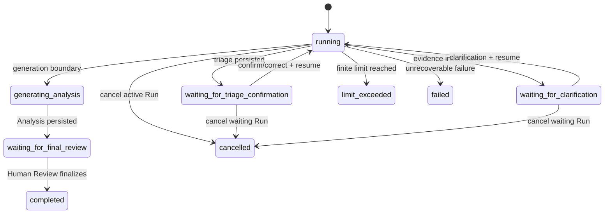
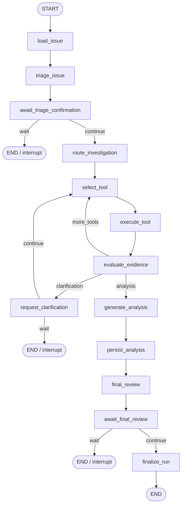

# Delivery Copilot - Agent State and Graph Design

## 1. Document Status

- Status: Current As-built Runtime Model + Validated LangGraph Migration Design
- Public source of truth: checked-out source, database schema, validators, and runtime acceptance evidence
- Runtime LangGraph dependency: `langgraph==1.2.10`
- Current business execution authority: `AgentRunnerService`
- LangGraph status: validated foundation, not current production Runner

This document separates two layers that previously appeared too similar in the public documentation:

1. the **current persisted Agent runtime state machine**, implemented by Runner/orchestration/persistence services; and
2. the **LangGraph migration foundation**, which models the same business workflow but has not taken over production execution.

The current repository implements Agent persistence, lifecycle APIs, bounded execution, deterministic context loading, triage, dynamic read-only Tool selection, guarded Tool execution, evidence evaluation, Human Clarification, Analysis persistence, Final Review, cancellation, and resume.

The repository also implements typed LangGraph state, compiled topology, nodes, routing, adapters, a single-step Driver, checkpoint identity classification, `AgentGraphStepCoordinator`, and constructor injection into `AgentRunnerService`.

Persistent production Checkpointer storage, automated DB/Checkpoint reconciliation, and full LangGraph Runner takeover remain outside the portfolio closure scope.

## 2. Design Objective

The Agent extends the fixed Grounded RAG issue-analysis flow into a controlled, stateful, interruptible, resumable, and auditable investigation workflow.

The design preserves the accepted Grounded RAG capabilities:

- Issue / Project / Customer context;
- knowledge retrieval;
- Grounded Evidence;
- six-field structured Analysis;
- Citation Snapshot;
- provider fallback;
- `AIAnalysisLog`;
- final Human Review.

The Agent adds persisted decision state and bounded multi-step investigation without turning the product into an unrestricted autonomous platform.

## 3. Current Runtime Scenario

A representative current runtime path is:

```text
User selects Issue
→ create or reuse active Agent Run
→ deterministic load_issue context step
→ triage_issue
→ waiting_for_triage_confirmation
→ human confirmation/correction
→ route_investigation
→ select_tool
→ execute_tool
→ evaluate_evidence
   ├─ another Tool
   ├─ Human Clarification
   └─ generate Analysis
→ persist Analysis
→ waiting_for_final_review
→ Human Review
→ completed
```

The accepted local clarification scenario completed at Step 21 with 3 Tool calls and 0 retries.

## 4. Agent Run Status

The implemented persistence model includes:

- `created`
- `running`
- `waiting_for_triage_confirmation`
- `waiting_for_clarification`
- `generating_analysis`
- `waiting_for_final_review`
- `completed`
- `failed`
- `cancelled`
- `limit_exceeded`

### 4.1 Status semantics

`created`
: Persisted Run exists but has not entered active execution.

`running`
: The current Runner is actively advancing a supported investigation step.

`waiting_for_triage_confirmation`
: Triage suggestion is persisted and execution is blocked on a human decision.

`waiting_for_clarification`
: Approved Tool evidence is insufficient and a focused human response is required.

`generating_analysis`
: The Run is at the Analysis generation/persistence boundary.

`waiting_for_final_review`
: `AIAnalysisLog` exists and the Run is blocked on the existing Human Review workflow.

`completed`
: Final Human Review has closed the workflow, including accepted, rejected, or edited-and-accepted outcomes.

`failed`
: An unrecoverable technical/validation failure ended execution.

`cancelled`
: The operator intentionally terminated the Run under an allowed cancellation path.

`limit_exceeded`
: A finite execution limit was reached.

Human rejection is not a technical failure.

## 5. Current Persisted State Contract

The runtime persists controlled JSON state on the Agent Run. Key state groups include:

### 5.1 Identity and execution position

- `run_id`
- `issue_id`
- graph/runtime version metadata
- current node
- Run status

### 5.2 Business context

- Issue context
- Project context
- Customer context
- confirmed/derived triage data

### 5.3 Tool investigation

- selected Tool
- Tool results
- Tool-call count
- Tool-result-derived state

### 5.4 Evidence evaluation

- retrieved evidence metadata
- evidence-sufficient decision
- evidence reason
- Agent similarity guardrail behavior

### 5.5 Human clarification

- clarification question
- clarification response
- persisted waiting/resume position

### 5.6 Final Analysis

- draft/structured Analysis state
- linked `analysis_log_id`

### 5.7 Safety and execution

- step count
- Tool-call count
- configured limits
- controlled errors
- terminal outcome

Serialized Agent state must not contain SQLAlchemy Sessions, ORM objects, provider clients, raw HTTP response objects, exception objects, API keys, credentials, or uncontrolled raw logs.

## 6. Runtime State Machine



The backend is authoritative for this state machine.

## 7. Current Runtime Steps

The current business Runner advances named execution steps that align with the product workflow.

### 7.1 `load_issue`

Responsibilities:

- load Issue / Project / Customer context through `AgentIssueContextService`;
- persist controlled context state;
- advance to triage.

This is deterministic context loading, not model-selected Tool use.

### 7.2 `triage_issue`

Responsibilities:

- generate a structured triage suggestion;
- validate issue type, subtype, severity, confidence, and reason;
- preserve the suggestion as reviewable state.

### 7.3 `await_triage_confirmation`

Responsibilities:

- persist the Human Gate;
- stop Runner continuation;
- wait for exactly one allowed resume payload;
- preserve the same Run identity on resume.

### 7.4 `route_investigation`

Responsibilities:

- determine whether investigation should continue;
- bind execution limits and routing state;
- choose whether Tool selection, evidence evaluation, or terminal handling is next.

### 7.5 `select_tool`

Responsibilities:

- select only from the approved dynamic Tool Registry;
- use current triage, prior Tool results, clarification, and execution budget;
- avoid unrestricted arbitrary Tool invocation.

### 7.6 `execute_tool`

Responsibilities:

- validate Tool registration and contracts;
- reserve/reuse persisted Tool-call identity;
- enforce execution policy and timeout;
- persist success/failure result;
- preserve replay-aware audit history.

### 7.7 `evaluate_evidence`

Responsibilities:

- evaluate current evidence sufficiency;
- apply the accepted Agent evidence boundary;
- decide whether to continue Tool use, ask for clarification, or generate an Analysis.

### 7.8 `request_clarification`

Responsibilities:

- create a focused question from persisted context/evidence gaps;
- enter `waiting_for_clarification`;
- resume only after valid human input.

### 7.9 `generate_analysis`

Responsibilities:

- reuse the six-field Analysis contract;
- reuse compatible provider/fallback behavior;
- exclude below-threshold Agent knowledge from the generation Prompt/Citation Snapshot.

### 7.10 `persist_analysis`

Responsibilities:

- create the final `AIAnalysisLog` exactly once;
- persist provider/retrieval/citation metadata;
- associate the Analysis with the Agent Run.

### 7.11 `final_review`

Responsibilities:

- transition to the persisted final-review waiting boundary;
- reuse the existing Analysis Human Review workflow.

### 7.12 `finalize_run`

Responsibilities:

- finalize the Agent Run after a Human Review outcome;
- preserve the final outcome and completion time;
- keep original AI output and human-edited output separate.

## 8. Current Tool Execution Model

The current dynamic approved Tool Registry contains:

1. `search_knowledge`
2. `get_analysis_history`
3. `calculate_delivery_risk`

All current dynamic Tools are read-only and do not require per-call approval.

Historical design documents described `load_issue_context` as a Tool. In the current implementation, context loading occurs in `load_issue` via `AgentIssueContextService`, outside the dynamic Tool Registry.

The Agent may:

- select different approved Tools;
- use prior Tool results to influence later choices;
- stop Tool use when evidence is sufficient;
- request Human Clarification when Tool evidence is insufficient;
- reuse a persisted Tool result when replay identity is valid.

The Agent must not:

- execute an unregistered Tool;
- execute write actions;
- bypass Tool input/output contracts;
- exceed the Tool-call budget;
- leak Sessions/provider clients into Agent state.

## 9. Persistence Mapping

### 9.1 `agent_runs`

Represents one persisted investigation workflow.

Contains Run identity, Issue linkage, current node/status, controlled state JSON, counters/limits, linked Analysis identity, error/terminal data, and timestamps.

### 9.2 `agent_steps`

Represents ordered execution steps for one Run.

A Step preserves node identity, sequence/index, input/output state, execution status, controlled error data, and timestamps.

### 9.3 `agent_tool_calls`

Represents Tool calls nested under a Step.

Stores Tool identity/version, arguments, result, read-only/approval metadata, timeout, status, error data, and timestamps.

### 9.4 `AIAnalysisLog`

Remains the business Analysis record and Human Review target.

The Agent Run can link to the Analysis without merging Agent execution audit state into the Analysis table.

## 10. Transaction and Lock Boundary

`AgentOrchestrationService` owns explicit transaction boundaries for Agent workflow operations.

`AgentPersistenceService` contains lock-aware state mutation helpers. Critical Run, Step, ToolCall, and linked Analysis reads use `SELECT ... FOR UPDATE` where the current state must be protected before mutation.

The Agent create API also locks the Issue row before active-Run reuse is decided.

Principles:

- Tool adapters do not own arbitrary commits;
- provider classes do not own Agent transactions;
- persisted state is checked before transition;
- completed audit records are not silently rewritten because a later step fails;
- failure persistence must not expose credentials/provider internals.

## 11. Resume and Idempotency Boundary

Resume is a continuation of persisted state, not a silent restart.

A resume request must:

- target an existing Run;
- target a resumable waiting status;
- supply exactly one supported human-input type;
- preserve prior Steps and ToolCalls;
- continue sequence numbers rather than overwrite history;
- avoid duplicate Analysis persistence;
- avoid unjustified Tool re-execution.

Replay-aware Tool persistence validates identity, current counters, and prior Tool-call state before reusing or reserving a call.

## 12. Concurrency Boundary

The current implementation does not claim production-scale high-concurrency performance, but it does implement state-protection mechanisms for concurrent requests.

For Agent creation:

```text
lock Issue row
→ query active Runs for Issue
→ if active Run exists: return it
→ else: create new Run
```

This protects the single-active-Run product rule from a straightforward duplicate-start race.

Critical persistence transitions use row locks to reduce conflicting state mutation.

## 13. Bounded Runner Loop

`AgentRunnerService.advance_investigation_until_boundary()` owns the current bounded execution loop.

The Runner:

- stops at waiting states;
- stops at terminal states;
- rejects unsupported current node/status combinations;
- verifies the current Step exists;
- tracks state signatures;
- detects repeated/stalled signatures;
- enforces a transition cap;
- enforces `max_steps`;
- enforces `max_tool_calls`;
- dispatches only supported nodes;
- verifies observable progress after each transition.

This is the current execution authority. It is not a wrapper around LangGraph.

## 14. Failure Rules

Handled Agent outcomes include:

- invalid current node/state;
- invalid resume input;
- missing resource;
- Tool failure/timeout;
- persistence conflict;
- stalled Runner loop;
- step/tool budget exhaustion;
- user cancellation;
- recovery cancellation after failed Step;
- unrecoverable technical failure.

The system uses explicit `failed`, `cancelled`, and `limit_exceeded` terminal statuses.

## 15. Human Interrupt Design

### 15.1 Triage Confirmation

The system persists a triage suggestion and enters `waiting_for_triage_confirmation`.

The operator may confirm or correct the structured triage data, then resume the same Run.

### 15.2 Human Clarification

If approved Tool evidence remains insufficient, the system persists a focused clarification question and enters `waiting_for_clarification`.

The accepted demo includes an API-timeout clarification path.

### 15.3 Final Review

After Analysis persistence, the Agent waits for the existing Human Review flow.

Accepted, rejected, and edited-and-accepted outcomes all close the business workflow while preserving the original AI output.

## 16. LangGraph State Contract

The validated LangGraph foundation defines a typed `AgentGraphState` with controlled JSON-safe fields, including:

- state schema version;
- Run/Issue identity;
- graph version;
- current node;
- transition count and max transitions;
- business context;
- triage state;
- Tool/evidence state;
- clarification state;
- Analysis linkage;
- final-review/finalization state.

The graph checkpoint thread identity derives from `AgentRun.run_id`.

Custom historical `checkpoint_id` pinning and custom `checkpoint_ns` are rejected by the single-step Driver configuration boundary.

## 17. LangGraph Nodes and Topology

The validated graph contains these node names:

```text
load_issue
triage_issue
await_triage_confirmation
route_investigation
select_tool
execute_tool
evaluate_evidence
request_clarification
generate_analysis
persist_analysis
final_review
await_final_review
finalize_run
```

The graph builder defines static and conditional edges between these nodes and can compile with a supplied Checkpointer. The checked-in validation helper can use `InMemorySaver`.



This topology is validated foundation behavior, not proof that it currently drives the production business Run.

## 18. Single-step Driver

`AgentGraphSingleStepDriver` executes exactly one expected scheduled node against a compiled graph checkpoint.

It:

- validates graph methods;
- validates normalized `thread_id` configuration;
- rejects caller-pinned `checkpoint_id`;
- rejects custom `checkpoint_ns`;
- reads the current checkpoint;
- requires exactly one scheduled node;
- requires that node to match `expected_node`;
- streams through exactly that node using `interrupt_after`;
- requires exactly one node update;
- captures before/after values and next-node state;
- rejects non-JSON-safe values.

The Driver is intentionally narrow so framework execution can be reconciled with persisted business state one step at a time.

## 19. Checkpoint Identity and Coordinator

`AgentGraphStepCoordinator` compares persisted business state with the latest graph checkpoint before executing a graph step.

The Coordinator validates:

- Run identity;
- expected node;
- serialized AgentGraph state;
- checkpoint values;
- checkpoint next-node identity;
- checkpoint/persisted-state relation.

Only a matched checkpoint relationship is allowed to proceed to the single-step Driver.

This is a migration safety boundary for future orchestration takeover.

## 20. Current Runner / LangGraph Boundary

The current relationship is:

```text
AgentRunnerService
  ├─ current real runtime path
  │   → orchestration/persistence/services
  │
  └─ _graph_step_coordinator
      → constructor-injected migration seam
      → not called by current Runner execution
```

Therefore the correct product claim is:

> The Agent runtime is stateful, persisted, bounded, interruptible, resumable, and auditable today. LangGraph is separately implemented and validated as a migration foundation, but it has not taken over the Runner.

## 21. Explicit Non-goals

This architecture does not include:

- autonomous Issue updates;
- automatic customer-message sending;
- write-capable Tools;
- arbitrary Tool registration;
- multi-agent collaboration;
- long-term Agent memory;
- authentication or RBAC;
- public cloud production deployment;
- production distributed workers;
- production Checkpointer deployment;
- automatic DB/Checkpoint reconciliation;
- production SLA or production-scale concurrency claim.

## 22. Implementation Gate and Claim Boundary

Verified as-built capabilities include:

- persisted `AgentRun`, `AgentStep`, and `AgentToolCall` records;
- current-state transaction/lock boundaries;
- active-Run reuse;
- bounded Runner execution;
- Tool registry/contracts/policy/guarded execution;
- replay-aware Tool result reuse;
- Human Triage Confirmation;
- Human Clarification;
- same-Run resume;
- structured Analysis persistence;
- Final Human Review;
- normal and recovery cancellation;
- Agent Investigation UI timeline;
- LangGraph typed state/topology/adapters;
- single-step Driver;
- checkpoint identity classification;
- `AgentGraphStepCoordinator`;
- constructor injection into `AgentRunnerService`.

The public repository may claim an implemented bounded single-agent workflow and a validated LangGraph orchestration foundation.

It must not claim full LangGraph production Runner takeover, a deployed persistent production Checkpointer, automatic DB/Checkpoint reconciliation, distributed worker coordination, production SLA, or multi-agent implementation.
