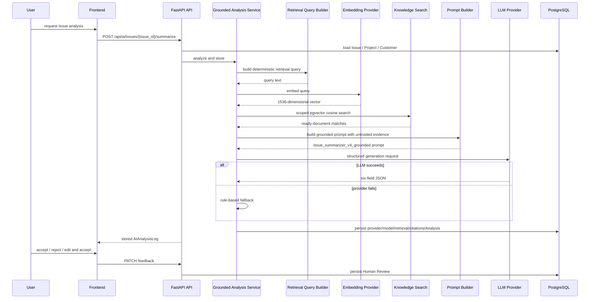
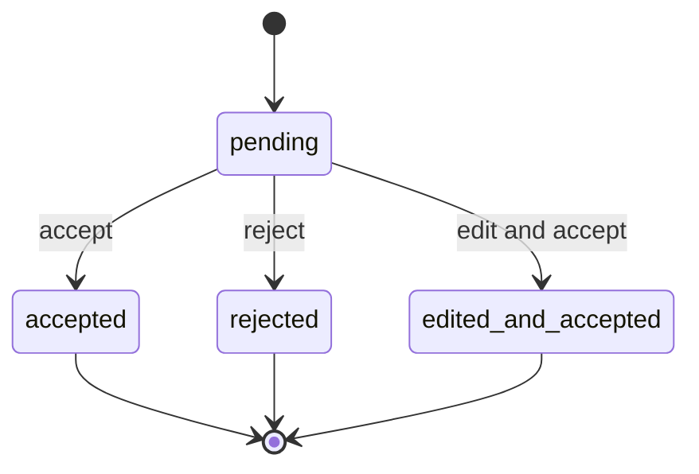
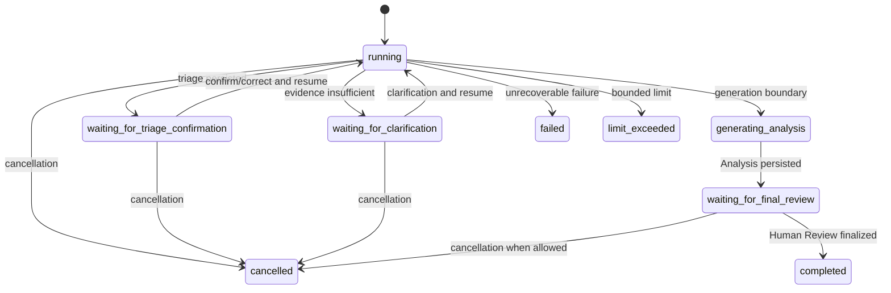
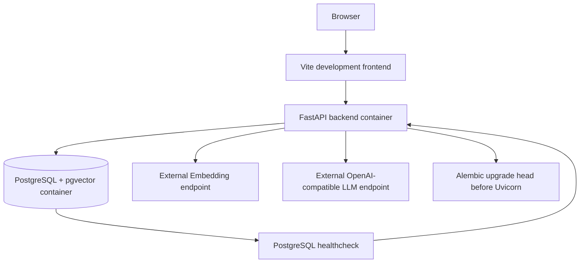

# Delivery Copilot — As-built Architecture

## 1. Purpose and Scope

This document describes the current public repository as implemented and accepted. It intentionally separates three things that were previously easy to conflate:

1. the persisted Grounded RAG analysis path;
2. the current bounded stateful Agent runtime; and
3. the validated LangGraph migration foundation.

Status: As-built documentation refresh. No runtime code change is implied by this document.

Source of truth: checked-out source, Alembic migrations, validators, runtime acceptance evidence, and the public repository files.

Delivery Copilot is an AI-powered enterprise delivery and issue management platform. It is not a generic chatbot and not a simple CRUD demo. The architecture focuses on grounded analysis, persisted execution state, bounded investigation, Human-in-the-loop control, auditability, and safe failure behavior.

The current Agent runtime is owned by `AgentRunnerService` and existing orchestration/persistence services. The validated LangGraph foundation has not taken over the production Runner execution path.

## 2. Architecture Summary

The current repository contains two real business execution paths and one migration foundation:

```mermaid
flowchart LR
  U[Operator] --> FE[React / TypeScript]
  FE --> API[FastAPI]

  API --> BIZ[Business Services]
  BIZ --> PG[(PostgreSQL)]

  API --> RAG[Persisted Grounded RAG]
  RAG --> RET[Retrieval Query Builder]
  RET --> EMB[text-embedding-v4]
  EMB --> VEC[pgvector Top-K cosine retrieval]
  VEC --> GP[Grounded Prompt]
  GP --> LLM[LLM Provider]
  LLM -. failure .-> RBF[rule-based fallback]
  LLM --> AL[AIAnalysisLog + Citation Snapshot]
  RBF --> AL
  AL --> HR[Human Review]

  API --> RUN[AgentRunnerService]
  RUN --> ORCH[AgentOrchestrationService]
  ORCH --> AP[Agent Persistence]
  AP --> PG
  RUN --> SVC[Agent Services / Approved Tools]
  SVC --> AL
  HR --> RUN

  RUN -. stores Coordinator but does not invoke it .-> COORD[AgentGraphStepCoordinator]
  COORD --> DRV[Single-step Driver]
  DRV --> LG[Compiled LangGraph]
  LG --> AD[Typed State / Nodes / Routing / Adapters]
```



The solid paths are current runtime behavior. The dashed Runner-to-Coordinator edge is a validated migration seam, not the active business execution path.

## 3. Product Workflow

The implemented operational workflow is:

```text
Customer
→ Project
→ Requirement / Issue
→ AI-assisted investigation or analysis
→ Grounded Evidence
→ Structured Analysis
→ Human Review
→ Analysis History / Agent audit trail
```

Customer, Project, Requirement, and Issue provide the operational context for delivery work.

The fixed Grounded RAG path is appropriate when one retrieval-and-generation pass is sufficient. The Agent path is used when investigation needs persisted intermediate state, bounded Tool use, Human Gates, clarification, resume, and an auditable execution timeline.

## 4. Current Agent Runtime Authority

The current Agent business path is implemented by `AgentRunnerService`, `AgentOrchestrationService`, `AgentPersistenceService`, and focused Agent services.

A simplified runtime sequence is:

```text
POST Agent Run
→ lock Issue and reuse an existing active Run when present
→ create Run
→ load Issue context deterministically
→ triage
→ persist wait for Human Triage Confirmation
→ resume same Run
→ route investigation
→ select one approved read-only Tool
→ execute / persist ToolCall
→ evaluate evidence
→ continue, clarify, or generate
→ persist AIAnalysisLog
→ wait for Final Human Review
→ finalize Agent Run
```

The Runner enforces finite transitions, `max_steps`, `max_tool_calls`, state/node consistency, and loop-stall detection. Waiting states and terminal states are explicit boundaries rather than implicit UI behavior.

`AgentRunnerService` accepts an `AgentGraphStepCoordinator` through constructor injection. The Runner stores the Coordinator but does not invoke it.

## 5. Agent State and Persistence Model

Agent execution is persisted separately from the final AI Analysis.

Primary objects:

- `AgentRun`: workflow identity, current state, status, counters, limits, linked Analysis, timestamps, and terminal outcome;
- `AgentStep`: ordered node/step execution with input/output state and failure data;
- `AgentToolCall`: nested Tool invocation identity, arguments, result, timeout, status, and error data;
- `AIAnalysisLog`: the structured analysis and Grounded RAG audit record used by the existing Human Review workflow.

This separation makes it possible to inspect where an Agent Run diverged before the final answer. A rejected or edited final result can be traced back through persisted Steps, ToolCalls, evidence, and state transitions.

Critical persistence operations use database row locks (`SELECT ... FOR UPDATE`) to protect current Run, Step, ToolCall, and linked Analysis state during controlled transitions.

## 6. Agent Tools and Deterministic Context Loading

The current dynamic approved Tool Registry contains exactly three tools:

- `search_knowledge`
- `get_analysis_history`
- `calculate_delivery_risk`

All approved tools are read-only and `requires_approval=false` in the current MVP.

Historical design documents referred to `load_issue_context` as a fourth Tool. In the current implementation, Issue context loading is deterministic and performed by the Runner/service path before dynamic investigation. It is not registered as a dynamically selected Tool.

This boundary deliberately keeps a mandatory precondition outside model-controlled Tool selection.

## 7. Agent Evidence and Human Control

The Agent uses an explicit evidence-evaluation stage instead of assuming every retrieved chunk is safe to use.

The accepted local demo uses a conservative similarity boundary of `0.65` for Agent evidence. Below-threshold chunks remain auditable in Tool result history but are excluded from generation and Citation Snapshots.

The Human-in-the-loop workflow has three major control points:

1. Triage Confirmation;
2. Human Clarification when available evidence is insufficient; and
3. Final Human Review of the persisted Analysis.

The accepted final review outcomes are:

- `accepted`
- `rejected`
- `edited_and_accepted`

Human rejection is a completed business-review outcome, not a technical Agent failure.

## 8. Grounded RAG Request Sequence

The fixed analysis path remains a first-class product capability and is not replaced by the Agent.



The Grounded Prompt version is `issue_summarizer_v4_grounded`.

## 9. Retrieval Scope Resolution

Grounded RAG uses contextual knowledge scopes:

- no context ID: global documents only;
- Customer context: global plus matching Customer documents;
- Project context: global plus Project Customer plus Project documents;
- Issue context: resolves Issue → Project → Customer, then searches the visible scope set.

Only documents with `status=ready` and a stored embedding participate in retrieval; archived documents are excluded from new retrieval.

The similarity calculation is based on pgvector cosine distance:

```text
similarity_score = 1 - cosine_distance
```

Deterministic tie-breaking preserves repeatability.

## 10. Knowledge Ingestion and Embedding

The implemented ingestion path supports manual knowledge-document creation, chunk persistence, single-chunk embedding, and batch embedding.

The configured embedding model is `text-embedding-v4` with 1536 dimensions. Provider metadata is persisted with embedding results. Failed chunks are isolated so one embedding error does not automatically invalidate a full batch, and safe retry is supported.

The embedding API configuration is independent from LLM provider configuration.

## 11. Grounded Prompt and Structured Output

Knowledge Evidence is treated as untrusted data. The prompt instructs the model not to follow role changes, Tool calls, or output-format instructions found inside retrieved evidence.

The structured output contract contains exactly six business fields:

- `issue_summary`
- `possible_root_cause`
- `recommended_actions`
- `customer_update_draft`
- `risk_level`
- `project_impact`

Provider output is parsed and validated before persistence. Malformed JSON, missing fields, invalid risk values, or invalid field types can trigger controlled fallback behavior.

## 12. Provider Failure and Degradation

The OpenAI-compatible LLM provider distinguishes controlled failure categories instead of treating all failures as successful generation.

Implemented fallback triggers include:

- missing API key;
- `httpx.TimeoutException`;
- HTTP status error;
- request / connection error;
- invalid JSON;
- schema validation error;
- malformed response structure;
- unexpected provider exception.

On these paths, the workflow degrades to the `rule-based fallback` provider and records provider/model behavior so fallback output is not silently represented as LLM output.

Retrieval failure, no-results retrieval, provider failure, and HTTP request failure remain separate concepts.

## 13. API, Concurrency, and Transaction Boundaries

The Agent API exposes:

- `POST /api/agent/runs`
- `GET /api/agent/runs/{run_id}`
- `POST /api/agent/runs/{run_id}/resume`
- `POST /api/agent/runs/{run_id}/cancel`

When a new Agent Run is requested, the API locks the related Issue row before checking for an existing active Run. If one exists, the current active Run is returned instead of intentionally creating a duplicate active workflow for that Issue.

The API distinguishes controlled outcomes including:

- 404 for missing Issue or Agent Run;
- 409 for invalid state transitions, bounded-loop conflicts, or incompatible workflow state;
- 422 for invalid Resume payload shape;
- 500 for database/persistence failures.

Orchestration services own transaction boundaries. Tool implementations do not own arbitrary database commits, and serialized Agent state does not contain database Sessions, ORM instances, provider clients, credentials, raw HTTP response objects, or exception objects.

## 14. Human-in-the-loop State Machines

### Analysis review



A finalized Analysis cannot be finalized twice. `edited_and_accepted` requires nonblank edited output, while the original AI output remains unchanged.

### Agent runtime



The backend, not the frontend, owns these transitions.

## 15. LangGraph Migration Foundation

The repository includes a real LangGraph foundation rather than a documentation-only diagram.

Implemented foundation components include:

- typed `AgentGraphState`;
- frozen graph node names;
- `StateGraph` construction and conditional routing;
- read-only and `execute_tool` adapters;
- `AgentGraphSingleStepDriver`;
- strict thread/checkpoint configuration;
- checkpoint identity classification;
- `AgentGraphStepCoordinator`;
- constructor injection into `AgentRunnerService`;
- checked-in validators for state, topology, adapters, Driver, Coordinator, and injection boundary.

The graph builder can compile with an `InMemorySaver` for foundation validation. Persistent production checkpoint storage and automated DB/Checkpoint reconciliation are not included.

The intended migration seam is:

```text
Existing AgentRunnerService / persisted business state
                 │
                 │ validated seam
                 ▼
       AgentGraphStepCoordinator
                 ▼
        Single-step Driver
                 ▼
        Compiled LangGraph
```

This design allows framework migration to be validated incrementally without rewriting the already accepted business Runner in one step.

## 16. Persistence and Audit Model

`AIAnalysisLog` persists at least:

- `issue_id`
- `provider`
- `model_name`
- `prompt_version`
- six structured output fields
- `retrieval_status`
- `retrieval_query`
- `knowledge_citations_json`
- `retrieval_error_code`
- `feedback_status`
- `feedback_note`
- `edited_output`
- timestamps

Generated text and Grounded Evidence are persisted separately. historical Citation Snapshots remain immutable even when the underlying knowledge document is later archived.

Agent execution is separately persisted in `agent_runs`, `agent_steps`, and `agent_tool_calls`. Alembic coverage reaches `0007_agent_run_terminal`.

Analysis #67 preserves the pre-cleanup Citation Snapshot. Analysis #68 is the clean portfolio record. Document #3 is the business-facing cited document; Document #4 was archived after acceptance and is excluded from new retrieval.

## 17. Frontend Evidence Layer

The frontend displays Grounded state, Retrieval Status, Prompt Version, Citation Count, Document Title/ID, Doc Type, Scope, Source Kind/Name, Similarity Score, structured Analysis fields, and Human Review status.

The Agent Investigation page additionally renders:

- Run identity and current status;
- current node and counters;
- Human Gates;
- generated Analysis;
- persisted Step timeline;
- nested ToolCalls;
- controlled Agent state;
- cancellation / refresh controls.

Browser rendering recursively hides `retrieval_query`, chunk text, source URI, credentials, provider endpoints, and secret-like fields from Agent state and Tool snapshots.

The frontend does not infer or persist lifecycle transitions locally.

## 18. Runtime and Deployment Topology



The backend runs on port 8000. The frontend development server runs on port 5173. PostgreSQL uses a Docker healthcheck; the backend service depends on a healthy database and applies Alembic migrations before starting Uvicorn.

This is a local Docker Compose runtime, not a public cloud deployment.

## 19. Verified Evidence

| Capability | Evidence |
| --- | --- |
| Real query embedding | `text-embedding-v4` request completed |
| Vector dimensions | 1536 |
| Retrieval | pgvector Top-K cosine search |
| Final clean Analysis | #68 |
| Accepted E2E evidence model | `gpt-5.5` |
| Configurable example default | `gpt-4.1-mini` |
| Prompt version | `issue_summarizer_v4_grounded` |
| Citation count | 1 |
| Citation document | Document #3 |
| Historical snapshot | Analysis #67 preserved |
| Archived test knowledge | Document #4 excluded from new retrieval |
| Human Review | accepted / rejected / edited_and_accepted tested |
| Agent runtime | persisted lifecycle, bounded execution, clarification, analysis, final review |
| Agent Tool audit | 3 read-only Tool calls in accepted clarification scenario |
| Browser redaction | sensitive Agent state and Tool fields hidden |
| LangGraph foundation | state, topology, adapters, Driver, Coordinator, checkpoint identity |
| Runner injection boundary | `AgentRunnerService` stores the Coordinator but does not invoke it |

- [Portfolio README](../README.md)
- [Grounded RAG acceptance report](grounded-rag-acceptance.md)
- [Analysis #67 evidence snapshot](evidence/grounded-rag-analysis-67.json)
- [Final Grounded Analysis screenshot](screenshots/analysis-68-grounded-rag.png)
- [Agent Demo runtime acceptance](agent/agent-demo-acceptance.md)

## 20. Security and Trust Boundaries

Knowledge Evidence is treated as untrusted data.

Credentials are runtime configuration. Retrieval query and full raw chunk text are not exposed in the normal frontend analysis view, and Agent Tool arguments/results/state are recursively redacted for sensitive fields before browser rendering.

All current Agent tools are read-only. Authentication and RBAC are not implemented, so the repository must not be described as a production multi-tenant enterprise deployment.

Provider calls leave the local Docker environment and reach configured external endpoints.

## 21. Known Limitations

- Authentication and RBAC are not implemented.
- No public cloud deployment is included.
- No CI/CD pipeline is included.
- Grounded RAG has been accepted on one primary real business scenario.
- No representative production evaluation dataset is included.
- Runtime demo records are local database state.
- The Agent Investigation UI is an operator-facing local demo, not a production operations console.
- The architecture has not been load-tested for production-scale concurrency.
- The accepted `0.65` Agent guardrail is a conservative demo baseline, not a universal calibrated threshold.
- The validated LangGraph foundation has not taken over the production Runner execution path.
- Persistent production checkpoint storage and automated DB/Checkpoint reconciliation are not included.
- Distributed workers, multi-agent orchestration, autonomous write tools, and production SLA are not implemented.
