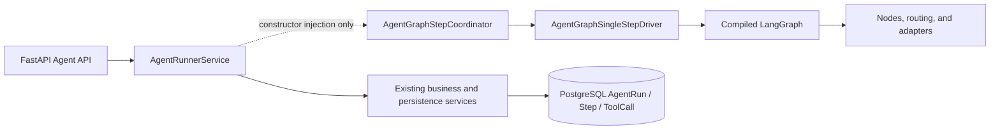
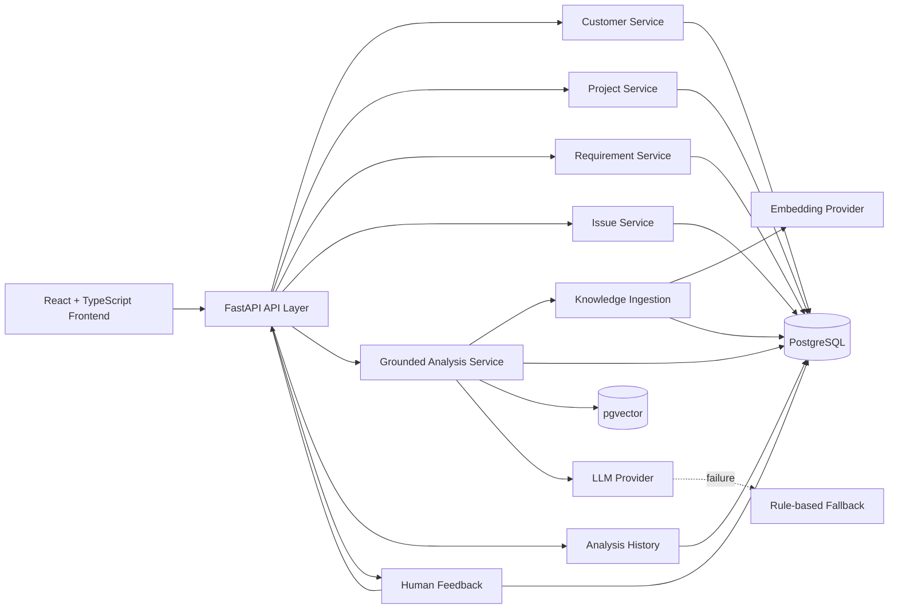
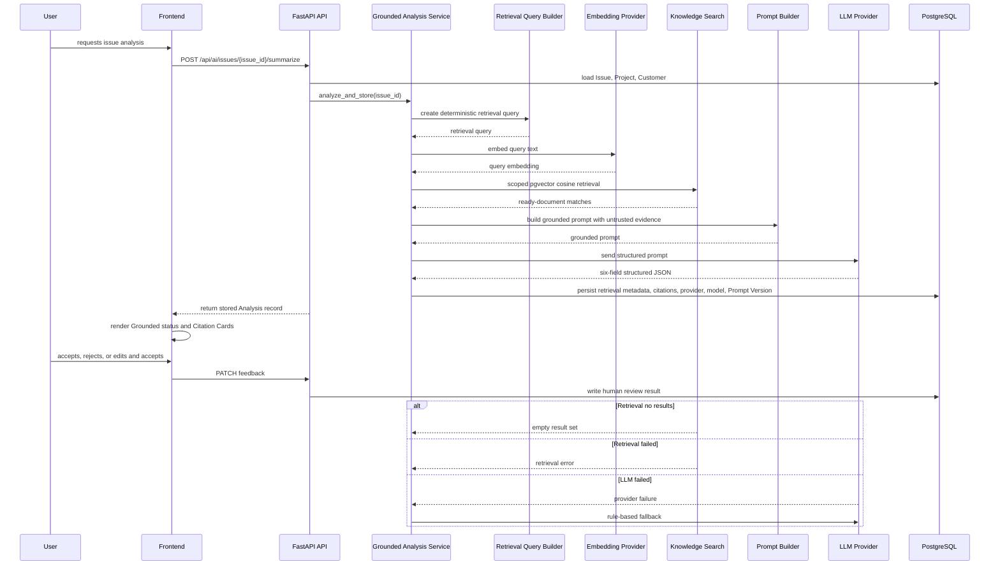
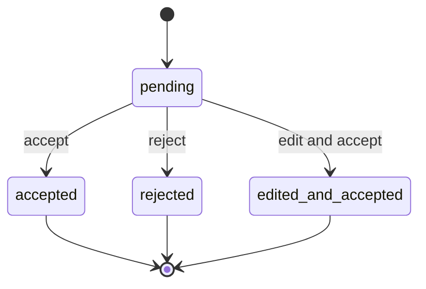
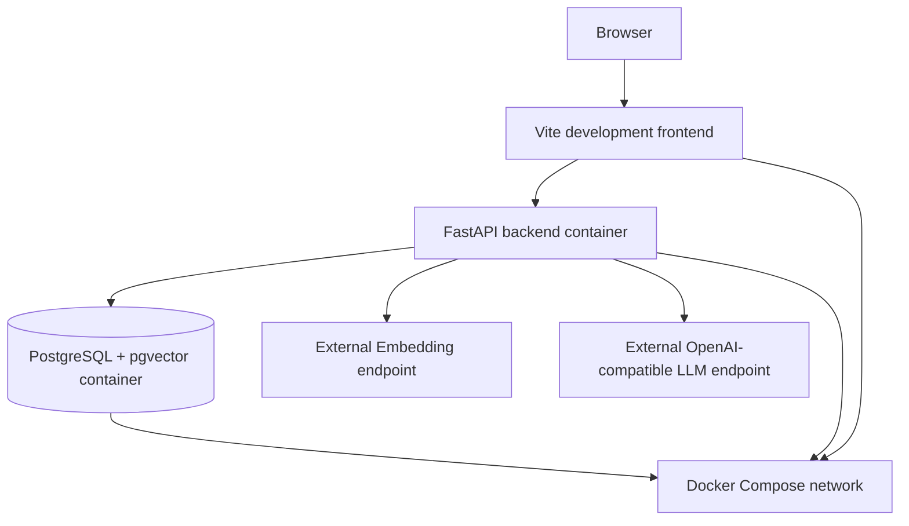

# Delivery Copilot — As-built Architecture

## 1. Purpose and Scope
This document describes the system that has already been implemented, run, and accepted in the current repository state.
Delivery Copilot is an AI-powered enterprise delivery and issue management platform.
It is not a generic chatbot.
It is not a simple CRUD demo.
The architecture focuses on grounded issue analysis, a persisted single-agent workflow, evidence and execution auditability, human review, and an incrementally validated LangGraph orchestration foundation.

## 2. Product Workflow
The implemented business workflow is:

Customer
→ Project
→ Requirement / Issue
→ AI-assisted Issue Analysis
→ Grounded Evidence
→ Human Review
→ Analysis History

Customer, Project, Requirement, and Issue provide the operational context for delivery work.
Issue is the entry point for Grounded RAG analysis.
Human Review is the final business closure step.

### Agent MVP and validated LangGraph foundation

The accepted Agent MVP adds persisted `AgentRun`, `AgentStep`, and `AgentToolCall` records; deterministic triage and tool selection; guarded read-only tool execution; bounded continuation; Human Clarification; analysis persistence; final-review waiting; and resume behavior.

The solid Runner-to-service path remains the current production business path. The dashed Runner-to-Coordinator edge is a validated migration seam: the Coordinator is injectable, but the production Runner does not yet call it.

The LangGraph foundation includes typed state, compiled topology, read-only adapters, an `execute_tool` adapter, a single-step Driver, checkpoint identity classification, and matched-checkpoint-only coordination. Persistent production checkpoint storage, bootstrap/reconciliation behavior, and full production takeover are documented roadmap items rather than completed claims.

## 3. System Context Diagram

Frontend only accesses the backend through REST API calls.
Embedding Provider and LLM Provider are configured independently.
PostgreSQL stores business data, knowledge data, analysis logs, and citation snapshots.
pgvector handles similarity retrieval.
LLM failure degrades to rule-based fallback.
Human feedback is written back to the Analysis Log.

## 4. Grounded RAG Request Sequence

Only documents with `status=ready` are eligible.
The retrieval policy ensures archived documents are excluded from new retrieval.
The audit model ensures historical Citation Snapshots remain immutable.

## 5. Retrieval Scope Resolution
No context ID means global documents only.
A `customer_id` resolves to global plus matching customer documents.
A `project_id` resolves to global plus the project customer plus project documents.
An `issue_id` resolves Issue → Project → Customer, then uses the visible global/customer/project scopes.
Issue is a retrieval context, not a KnowledgeDocument scope.
Missing linked Project degrades according to the implemented runtime behavior.

Resolved scope types are ordered as global, customer, then project.
Archived, failed, and pending documents do not participate in ready retrieval.
`embedding IS NOT NULL` is part of the retrieval candidate filter.
The similarity order is ascending cosine distance.
`similarity_score = 1 - cosine_distance`.
Deterministic tie-breakers preserve repeatability.

## 6. Knowledge Ingestion and Embedding
The implemented ingestion pipeline supports manual knowledge document ingestion and text chunking.
`KnowledgeDocument` and `KnowledgeChunk` are persisted in PostgreSQL.
Single-chunk embedding and batch embedding backfill are implemented.
Existing embeddings are skipped by default and can be forced when needed.
Per-chunk failure isolation keeps one failed chunk from blocking the rest of the batch.
Safe retry is supported.
The embedding provider is `text-embedding-v4` with 1536 dimensions.
Provider metadata is stored alongside the embedding result.
Embeddings are stored in pgvector.
Embedding API Key and LLM API Key are separate runtime concerns.

## 7. Grounded Prompt and Structured Output
The grounded prompt version is `issue_summarizer_v4_grounded`.
Knowledge Evidence is limited to at most 5 items, and each item is length-limited before being inserted into the prompt.
Evidence is wrapped in an explicit untrusted boundary.
The prompt instructs the model not to follow role changes, tool calls, or output-format instructions that appear inside the evidence.

The structured output contract contains exactly six fields:

- `issue_summary`
- `possible_root_cause`
- `recommended_actions`
- `customer_update_draft`
- `risk_level`
- `project_impact`

LLM output must satisfy the structured JSON / Pydantic contract.
Prompt construction failure or provider failure can trigger rule-based fallback.
Fallback results still record provider and model metadata.

## 8. Persistence and Audit Model
`AIAnalysisLog` persists at least the following fields:

- `issue_id`
- `provider`
- `model_name`
- `prompt_version`
- the six structured output fields
- `retrieval_status`
- `retrieval_query`
- `knowledge_citations_json`
- `retrieval_error_code`
- `feedback_status`
- `feedback_note`
- `edited_output`
- timestamps

Generated text and Grounded Evidence are persisted separately.
Citation Snapshots are immutable historical evidence.
Knowledge document metadata cleanup does not rewrite old Analysis records.

Agent execution is persisted separately in `agent_runs`, `agent_steps`, and `agent_tool_calls`. Existing orchestration and persistence services own transactions, row locks, state advancement, and audit writes; LangGraph nodes and the single-step Driver do not own database sessions or commit boundaries.

Analysis #67 preserves the pre-cleanup Citation Snapshot.
Document #4 was archived after acceptance.
Analysis #68 contains only the clean business-facing Document #3 evidence path.

## 9. Human-in-the-loop State Machine

A finalized Analysis cannot be finalized twice.
A second feedback PATCH returns conflict.
`edited_and_accepted` requires nonblank `edited_output`.
Edited output is stored separately.
The original AI output remains unchanged.
`feedback_note` is optional and trimmed.

## 10. Frontend Evidence Layer
The frontend displays a Grounded Badge, Retrieval Status, Prompt Version, Citation Count, Document Title, Document ID, Doc Type, Scope, Source Kind, Source Name, and Similarity Score.
It does not display `retrieval_query`, `chunk_text`, `source_uri`, credentials, or provider endpoints.
Current Analysis and Analysis History use the same Evidence Renderer, which avoids field loss and presentation drift.

## 11. Failure Handling
The system explicitly handles missing Issue / Project / Customer records, invalid request schema, missing embedding configuration, embedding provider failure, no retrieval results, malformed retrieval response, LLM timeout, malformed LLM JSON, rule-based fallback, persistence transaction safety, duplicate feedback finalization, Agent step/tool-call limits, timeout and cancellation, idempotent resume, human waiting boundaries, and checkpoint identity mismatch classification.

HTTP request failure, `retrieval_status`, provider metadata, and persisted Analysis state are related but separate concerns.
The implementation records the failure mode it can safely persist without exposing secrets or raw provider internals.
The system does not claim full observability for every internal exception path.

## 12. Runtime and Deployment Topology

The backend runs on port 8000.
The frontend development server runs on port 5173.
PostgreSQL is exposed on the configured local port.
Alembic applies schema revisions, and the accepted schema includes Grounded RAG plus Agent persistence and terminal-consistency migrations through `0007_agent_run_terminal`.
The deployment is a local Docker Compose runtime, not a public cloud deployment.

## 13. Verified Evidence

| Capability | Evidence |
| --- | --- |
| Real query embedding | text-embedding-v4 request completed |
| Vector dimensions | 1536 |
| Retrieval | pgvector Top-K cosine search |
| Final clean Analysis | #68 |
| LLM provider | llm |
| Model | gpt-5.5 |
| Prompt version | issue_summarizer_v4_grounded |
| Retrieval status | succeeded |
| Citation count | 1 |
| Citation document | Document #3 |
| Historical snapshot | Analysis #67 preserved |
| Archived test knowledge | Document #4 excluded from new retrieval |
| Frontend build | TypeScript and Vite production build passed |
| Human review | accepted / rejected / edited_and_accepted tested |
| Accepted E2E evidence model | `gpt-5.5` |
| Configurable example default | `gpt-4.1-mini` in `.env.example` and `compose.yaml` |
| Agent MVP evidence | Persisted lifecycle, bounded execution, tool, clarification, analysis, and final-review validators |
| LangGraph foundation | State, topology, adapters, Driver, Coordinator, and Runner injection validated |
| Runner injection boundary | `AgentRunnerService` stores the Coordinator but does not invoke it |
| Public validation | Checked-in documentation and Agent/LangGraph validators |

- [Portfolio README](../README.md)
- [Grounded RAG acceptance report](grounded-rag-acceptance.md)
- [Analysis #67 evidence snapshot](evidence/grounded-rag-analysis-67.json)
- [Final Grounded Analysis screenshot](screenshots/analysis-68-grounded-rag.png)

## 14. Security and Trust Boundaries
Knowledge Evidence is treated as untrusted data.
Credentials are environment configuration, not persisted in public documentation.
Retrieval query and raw chunk text are not exposed in the UI.
No authentication or RBAC is implemented.
This is a local portfolio runtime, not a production multi-tenant deployment.
Provider calls leave the local Docker environment and reach configured external endpoints.

## 15. Known Limitations
Authentication and RBAC are not implemented.
No public cloud deployment is included.
No CI/CD pipeline is included.
Grounded RAG has been accepted on one primary real business scenario.
No dedicated Grounded RAG evaluation dashboard exists.
Runtime demo records are local database state.
The frontend is functional but not a mature design system.
The architecture has not been load-tested for production-scale concurrency.
The validated LangGraph foundation has not taken over the production Runner execution path.
Persistent production checkpoint storage and automated DB/Checkpoint reconciliation are not included.
